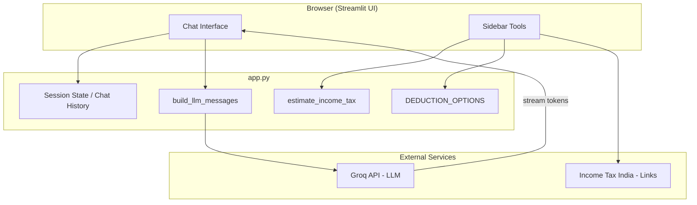

# Tax Genius — Your Smart Filing Assistant

**Girl Hackathon 2025 · Software Engineering Track · Finance**

Tax Genius is an AI-powered tax assistant that simplifies Indian income-tax filing: answer tax questions in natural language, estimate liability from income, explore common deductions, and open official filing resources—all in one Streamlit app.

| | |
|---|---|
| **Problem** | Tax filing involves complex rules, easy mistakes, and missed deductions. |
| **Solution** | Conversational AI (Groq LLM) + deterministic tax estimator + deduction checklist. |
| **Participant** | Sonali Kumari |
| **Repository** | [github.com/SonaliKumari2/Tax_Genius](https://github.com/SonaliKumari2/Tax_Genius) |

> **Disclaimer:** Tax Genius is a hackathon demo. Calculations are simplified estimates. Always verify with [Income Tax India](https://www.incometax.gov.in) or a qualified tax professional before filing.

---

## Features

| Feature | Description |
|---------|-------------|
| **AI Tax Chatbot** | Ask questions about ITR forms, deductions, deadlines, and concepts. Powered by **Groq** (`llama-3.1-8b-instant`) with streaming responses. |
| **Income Tax Estimator** | Sidebar calculator using progressive **Old Regime** slab rates (demo; excludes cess, rebate u/s 87A, and regime choice). |
| **Deductions Finder** | Multi-select checklist for common sections (80D, 24, 80E, 80G) with short plain-language hints. |
| **Tax Resources** | Quick links to official Indian income-tax forms and ITR-2 filing help. |
| **Session Chat** | Conversation history in `st.session_state`; **Clear chat** resets the thread. |
| **Configurable prompts** | Optional `INITIAL_RESPONSE` and `CHAT_CONTEXT` via `.env` or Streamlit secrets. |

---

## Architecture



**Design choices**

- **LLM for language, rules for numbers:** Chat uses the model for explanations; tax amounts use fixed slab logic so estimates stay reproducible and interview-friendly.
- **No server-side user database:** Queries live only in the browser session unless you deploy with logging—aligned with a privacy-first hackathon scope.
- **Secrets:** API keys load from `.env` locally or `.streamlit/secrets.toml` on Streamlit Cloud.

---

## Tech Stack

| Layer | Technology |
|-------|------------|
| UI | [Streamlit](https://streamlit.io/) |
| LLM | [Groq API](https://console.groq.com/) — Llama 3.1 8B |
| Config | `python-dotenv`, Streamlit secrets |
| Language | Python 3.10+ |

---

## Prerequisites

- Python **3.10** or newer  
- A free **[Groq API key](https://console.groq.com/keys)**  
- Git (to clone the repo)

---

## Installation & Setup

### 1. Clone the repository

```bash
git clone https://github.com/SonaliKumari2/Tax_Genius.git
cd Tax_Genius
```

### 2. Create and activate a virtual environment

**Windows (PowerShell):**

```powershell
python -m venv venv
.\venv\Scripts\Activate.ps1
```

**macOS / Linux:**

```bash
python3 -m venv venv
source venv/bin/activate
```

### 3. Install dependencies

```bash
pip install -r requirements.txt
```

### 4. Configure API key

Copy the example env file and add your key:

```bash
copy .env.example .env
```

Edit `.env`:

```env
GROQ_API_KEY=your_groq_api_key_here
```

**Alternative (Streamlit Cloud / secrets):** create `.streamlit/secrets.toml`:

```toml
GROQ_API_KEY = "your_groq_api_key_here"
```

---

## How to Run

```bash
streamlit run app.py
```

Open **http://localhost:8501** in your browser.

### Run tests (optional)

```bash
pip install pytest
pytest tests/test_tax.py -q
```

### GitHub Codespaces

This repo includes `.devcontainer/devcontainer.json` for GitHub Codespaces: dependencies install on open and port **8501** forwards to the Streamlit app.

---

## Project Structure

```
Tax_Genius/
├── app.py              # Main Streamlit application
├── requirements.txt    # Python dependencies
├── .env.example        # Template for local secrets
├── README.md           # This file
├── INTERVIEW.md        # Interview Q&A prep tied to the codebase
├── tests/test_tax.py   # Unit tests for tax estimator
├── .devcontainer/      # GitHub Codespaces config
└── .gitignore
```

---

## Usage Guide

1. **Chat:** Type a question (e.g. *“What is Section 80C?”* or *“When is ITR due?”*) and read the streamed reply.  
2. **Estimator:** Enter annual taxable income in the sidebar to see an approximate tax figure.  
3. **Deductions:** Select items that apply; read the info cards for each section.  
4. **Links:** Use sidebar links to open official forms and filing guides.  
5. **Reset:** Click **Clear chat** to start a new conversation.

---

## Hackathon Alignment

| Rubric | How Tax Genius addresses it |
|--------|------------------------------|
| **Impact (25%)** | Lowers friction for individual taxpayers and freelancers; plain-language guidance and deduction awareness. |
| **AI / DS (40%)** | NLP chat via Groq; rule-based slab engine for transparent tax math. |
| **Code quality (20%)** | Modular functions, documented slabs, separated UI/tools/LLM paths. |
| **Testing (15%)** | `tests/test_tax.py` covers slab boundaries; see INTERVIEW.md for manual chat checks. |

**Future enhancements (not in current scope):** document upload (OCR), new vs old regime toggle, Section 80C/80D amount caps, automated ITR pre-fill, and RAG over official tax circulars.

---

## Security & Privacy

- Do **not** commit `.env` or `secrets.toml` (listed in `.gitignore`).  
- Avoid pasting PAN, Aadhaar, or full financial statements into the chat in production.  
- API calls go to Groq; review [Groq’s privacy policy](https://groq.com/legal) before production use.

---

## Troubleshooting

| Issue | Fix |
|-------|-----|
| `KeyError: GROQ_API_KEY` | Create `.env` or `secrets.toml` with a valid key. |
| Model / API errors | Confirm key at [console.groq.com](https://console.groq.com); check model name in `app.py`. |
| Port 8501 in use | `streamlit run app.py --server.port 8502` |
| Old `llama3-8b-8192` errors | Project uses `llama-3.1-8b-instant`; update Groq SDK if needed. |

---

## References

- [Income Tax Department — Forms](https://incometaxindia.gov.in/Pages/downloads/most-used-forms.aspx)  
- [How to file ITR-2](https://www.incometax.gov.in/iec/foportal/help/how-to-file-itr2-form)  
- [PIB — Tax updates](https://pib.gov.in/PressReleasePage.aspx?PRID=1998906)  
- [Open Budgets India](https://openbudgetsindia.org/dataset?tags=IPFS)

---

## License

Open-source for hackathon submission and learning. Add an explicit license file before commercial use.

---

**Tax Genius** — Amplifying human potential by making tax filing clearer, faster, and less error-prone.
